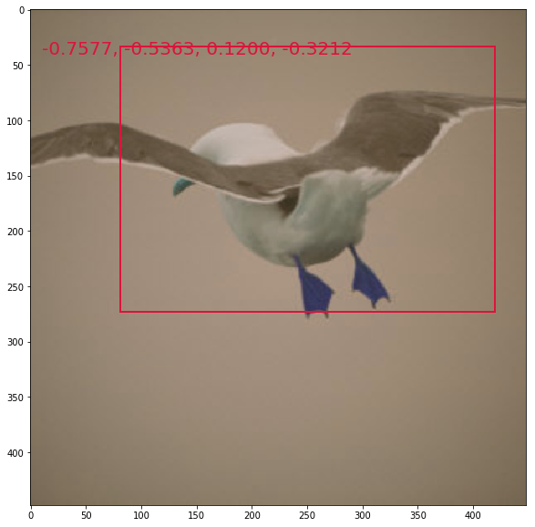
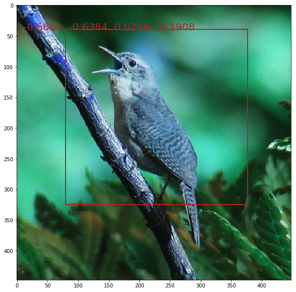
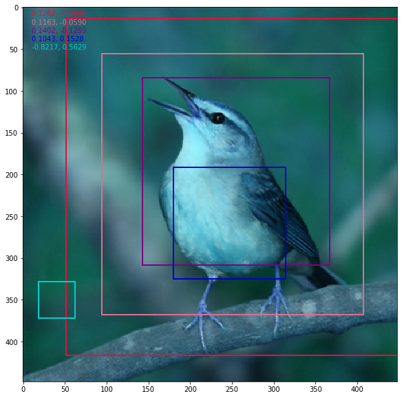
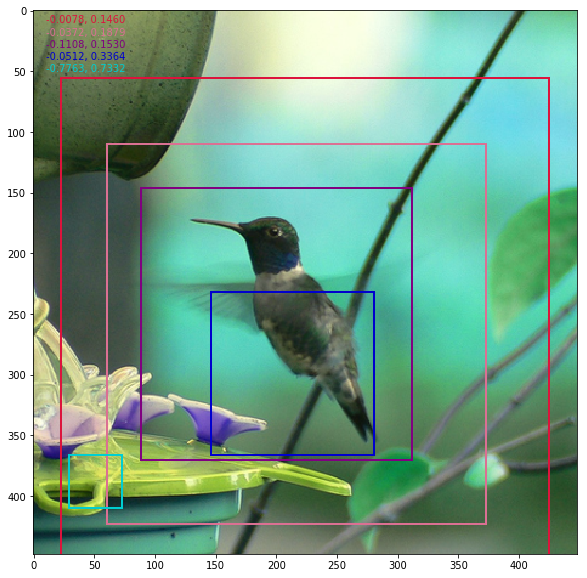

# pytorch STN
This is a third party implementation of STN in pytorch which written in [paper](https://arxiv.org/abs/1506.02025)

## Requirements
- opencv(for load data faster)
- python3
- Pytorch >= 0.4.1
- torchvision
- numpy

## TODO
- [x] Network building
- [x] Multi STN
- [x] Train


## Results

| Network | Test Acc | 
|:---:|:---:|
| Paper Best| 84.1 | 
| Implement| 85.71 |  

## Usage

For training, use following command.

```bash
$ python train.py
```

Currently only cuda available device support.

### docker

See [README.md](docker/README.md)

## Visualization

single stn (learn [[a, 0, c], [0, e, f]])





multi stn (learn [[parallel, 0, c], [0, parallel, f]], parallel=[0.9, 0.7, 0.5, 0.3, 0.1]), 





Seen from the results, parallel=[0.9, 0.7, 0.5] is enough.

## References


